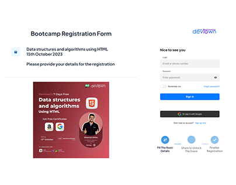
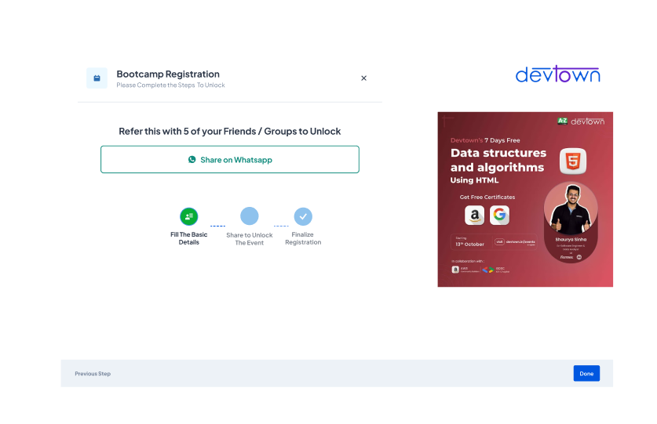
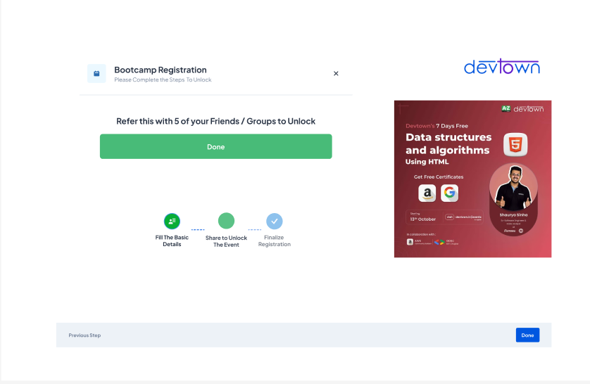
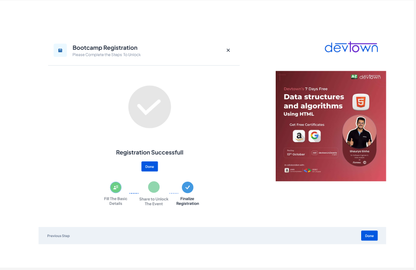

# 🚀 DevTown Bootcamp Registration

**A modern, multi-step registration UI for DevTown’s 7-Day Bootcamp.  
Social, seamless, and built for next-gen learners.**

---

## 📋 Project Overview

This repo features the complete journey for user-friendly bootcamp registration, including referral unlock and integrated authentication—all presented with a minimal, branded design:

- Progressive registration steps guide users
- Referral unlock promotes organic reach
- Clean login and event details section
- Built for mobile, tablet, and desktop

---

## 🌟 Features

- Multi-step form: Info collection → Social sharing → Confirmation
- Share-to-unlock event mechanism (WhatsApp & more)
- Social-friendly, high-trust UI
- Responsive, sleek design
- Google, Apple, GitHub sign-in integration (visualized)

---

## 📸 Screenshots

**Step 1 – Introduction**  

**Step 2 – Share to Unlock**  

**Step 3 – Registration Success**  

**Event Information & Login**  

---

## 🛠️ Design Highlights

- Built in Figma for pixel-perfect handoff
- DevTown brand colors, logo, and UI atoms
- Clear navigation prompts and progress indicators
- Celebratory success and error states
- Designed for a frictionless experience across all platforms

---

## 👤 Author

[Pranay Kumar](https://github.com/mudigondapranay)  
[Behance Portfolio](https://www.behance.net/pranaykumar23)  
[LinkedIn](https://www.linkedin.com/in/mudigondapranay/)

---

## 🤝 Contributions

Feedback and PRs welcome—improve flows, UI, or add new social integrations (open an issue or PR).

---

## ⚡ License

UI & design IP—contact for commercial use/collaborations.

---

> _Empowering learners with simple, verified, and viral registration journeys._
